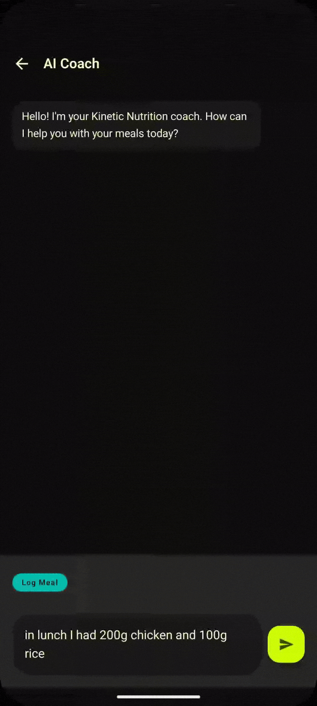
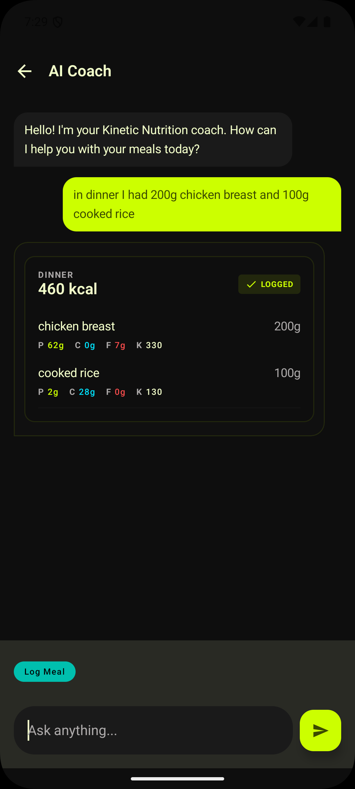
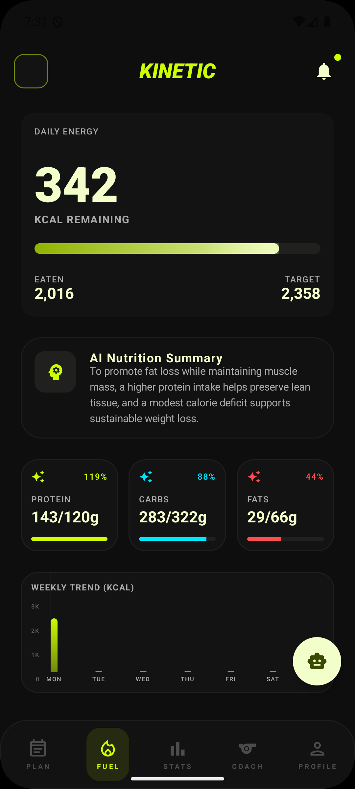
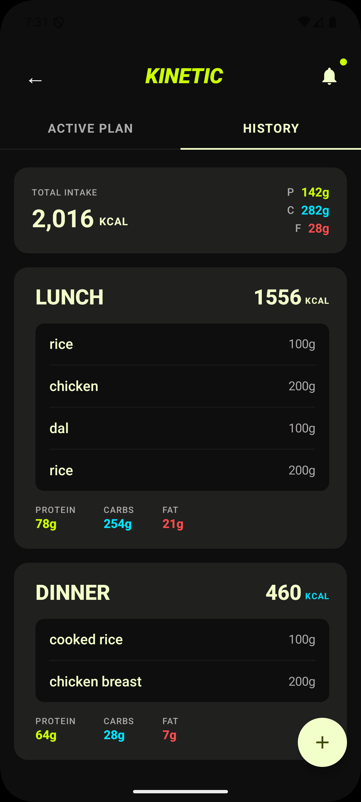

# Kinetic — AI-Powered Fitness Tracker

A Kotlin Multiplatform app for Android and iOS that lets users log meals through natural language, with GPT-4o parsing the input into structured nutrition data in real time.

> "I had 2 eggs and a roti" → instant calorie + macro breakdown, saved to your daily log.

---

## Demo



*Typing a meal in natural language → GPT-4o returns calories, macros, and gram weights → instantly logged*

| AI Meal Logging | Nutrition Dashboard | Diet History |
|:-:|:-:|:-:|
|  |  |  |

---

## What it does

- **Natural language meal logging** — type what you ate, GPT-4o extracts food items, estimates portion weights in grams, and returns calories + macros (protein, carbs, fat)
- **Personalized targets** — onboarding collects age, weight, height, goal, and activity level; a separate AI call calculates your daily calorie and macro targets using a nutrition strategy prompt
- **Diet plan** — structured meal plan generated from your profile, with per-meal macro breakdowns
- **Fuel dashboard** — daily calorie ring, macro progress bars, and meal history
- **Workout plan** — auto-generated push/pull/legs split with set/rep tracking
- **Progress tracking** — weight log with trend chart
- **Firebase auth** — shared GitLive Auth with Android Credential Manager and iOS Google Sign-In

---

## Architecture

Compose Multiplatform UI and shared controllers/repositories run on both platforms. Platform source sets provide only SDK, filesystem, HTTP-engine, and host integrations.

```
composeApp/
├── src/commonMain/       # Shared Compose UI, controllers, data, persistence, and DI
├── src/androidMain/      # Android Application, Credential Manager, OkHttp, and paths
└── src/iosMain/          # iOS Koin host, Google Sign-In bridge, Darwin, and paths
iosApp/                   # SwiftUI host, Firebase initialization, and CocoaPods
```

**State management:** Kotlin Flow + shared feature controllers
**DI:** Koin
**Async:** Coroutines throughout; no RxJava

---

## LLM Integration

All AI logic lives in `composeApp/src/commonMain/kotlin/com/shverma/kinetic/data/`.

### How meal logging works

```
User types "2 eggs, 1 roti"
  → AIChatController.sendMessage()
  → DietAIRepository.logFood()
  → FoodAIService builds a shared Ktor OpenAI request:
      • system prompt: strict JSON schema, portion size rules, common Indian food gram estimates
      • user message: the input + full user profile (age, weight, goal, activity)
  → GPT-4o-mini returns structured JSON
  → Parsed into AILogResponse (meal type, food items, grams, confidence score)
  → Converted to UI state → user sees breakdown
  → User taps "Save" → inserted into Room
```

### Prompt design

Three purpose-built system prompts in `AIPrompts.kt`:

| Prompt | Purpose | Output |
|--------|---------|--------|
| `logMealSystemPrompt` | Parse natural language meals | `AILogResponse` — food items with gram weights |
| `getNutritionPer100gPrompt` | Batch nutrition lookup | Calories + macros per 100g per food item |
| `initStrategyPrompt` | Personalized macro calculation | Daily calorie target + protein/carb/fat split |

Key design choices:
- JSON-only responses enforced in the system prompt
- User profile injected as context in every meal-logging request so portion estimates are personalized
- Confidence scoring per food item; fallback nutrition values kick in below threshold
- Validation layer on parsed values (calorie range sanity checks, null guards)

---

## Tech Stack

| Layer | Technology |
|-------|-----------|
| Language | Kotlin Multiplatform |
| UI | Compose Multiplatform, Material 3 |
| Navigation | Shared Compose route state |
| AI | OpenAI API (GPT-4o-mini) via Ktor |
| Local DB | Room KMP + bundled SQLite |
| Remote DB | GitLive Firebase Firestore |
| Auth | GitLive Firebase Auth, Android Credential Manager, iOS Google Sign-In |
| DI | Koin |
| Async | Kotlin Coroutines, Flow |
| Logging | Kermit |
| Serialization | kotlinx.serialization |
| Preferences | DataStore |

---

## Setup

### Prerequisites
- Android Studio Hedgehog or later
- JDK 17
- An OpenAI API key (GPT-4o or GPT-4o-mini access)
- A Firebase project with Auth and Firestore enabled

### Steps

1. Clone the repo:
   ```bash
   git clone https://github.com/sh7verma/kinetic-ai-fitness.git
   ```

2. Add a `local.properties` file in the project root (already in `.gitignore`):
   ```properties
   OPENAI_API_KEY=sk-...your-key-here...
   ```

3. Add your Android `google-services.json` to `composeApp/`:
   - Open [Firebase Console](https://console.firebase.google.com) → your project → Project Settings
   - Download `google-services.json` and place it at `composeApp/google-services.json`
   - This file is in `.gitignore` and is **not included in the repo** — you must supply your own

4. For iOS, copy `iosApp/Configuration/Config.local.xcconfig.example` to `iosApp/Configuration/Config.local.xcconfig` and fill in your local OpenAI key and OAuth client ID. Add the user-provided `GoogleService-Info.plist` to the `iosApp` target.

5. Build and run on Android (API 26+) or iOS 14.1+.

> **Note on API key security:** The key is read via `BuildConfig` at compile time. For a production release, replace the direct OpenAI call with a backend proxy so the key is never embedded in the APK.

---

## Design System

The app uses a custom design language called **Kinetic Precision**:
- Background: obsidian `#0E0E0E`
- Primary accent: high-voltage lime `#CAFD00`
- Secondary accent: neon cyan `#00E3FD`
- Typography: Lexend (display), Space Grotesk (labels)
- Components: `KineticProgressBar`, `KineticDataCard`, `KineticTopAppBar`

---

## Key Files

| File | What it does |
|------|-------------|
| `FoodAIService.kt` | Orchestrates all OpenAI API calls |
| `AIPrompts.kt` | System prompt templates |
| `DietAIRepository.kt` | Combines AI + Room + Firestore for food logging |
| `AIChatController.kt` | Shared state and meal-logging orchestration |
| `KtorOpenAIClient.kt` | Shared OpenAI transport boundary |
| `KineticKoinModule.kt` | Shared Koin bindings |
| `MacrosCalculator.kt` | Converts AI strategy response to daily targets |

---

## License

MIT
