# Kinetic — App Architecture & Logic

A complete walkthrough of how Kinetic works end to end: navigation, screens, data flow, and the AI integration — as of the post-redesign codebase (see `docs/redesign/PHASES.md` for how it got here). Diagrams are Mermaid; they render natively on GitHub.

---

## 1. What the app does

Kinetic lets a user describe a meal in plain English ("2 eggs and a roti"), sends it to an LLM (`gpt-4o-mini`) which returns structured food items with gram estimates, calories, macros, a per-item **confidence score**, and a short **assumption** string (what was assumed about portion/cooking method). The user reviews, corrects, or flags each item, then saves it — the running daily total and a "quick repeat" of recent meals live on the Fuel dashboard. Daily calorie/macro targets are computed once at onboarding (and re-computed on demand from Profile) via a second AI call plus a deterministic Mifflin-St Jeor calculation.

---

## 2. Tech stack & layering

| Layer | Technology |
|---|---|
| UI | Jetpack Compose, Material 3, Navigation-Compose |
| State | ViewModel + Kotlin `StateFlow`/`SharedFlow` |
| DI | Hilt |
| Local persistence | Room (food catalog + food logs), DataStore (user profile, prefs) |
| Remote persistence | Firebase Firestore (profile backup, shared food catalog) |
| Auth | Firebase Auth via Google Sign-In (Credential Manager) |
| AI | OpenAI `gpt-4o-mini` via Retrofit, called directly from the client |
| Async | Kotlin Coroutines + Flow throughout |

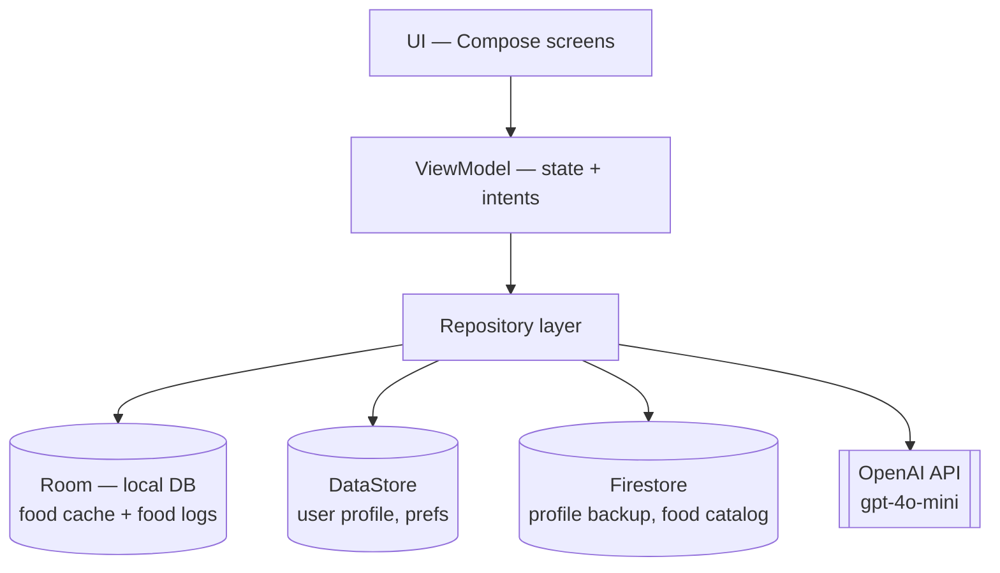

**Known architectural risk** (tracked in `docs/APP_UPDATE.md` as a P0 item, not yet fixed): the OpenAI API key is embedded in the Android client (`BuildConfig.OPENAI_API_KEY`) and called directly — there is no backend proxy. This is fine for local development/testing but must move server-side before any real-user distribution.

---

## 3. App entry & navigation graph

Two Activities, each hosting its own Compose `NavHost`:

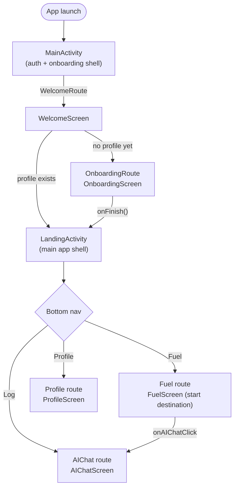

- `MainActivity`'s `NavHost` starts at `Routes.WelcomeRoute`. It has exactly two destinations: Welcome and Onboarding.
- `LandingActivity`'s `NavHost` starts at `LandingRoutes.Fuel` and has exactly three destinations — Fuel, Profile, AIChat — matching the three permanent bottom-nav tabs (Log/Fuel/Profile). There is no back button anywhere in this shell; "Log" is a peer tab, not a pushed screen, and Android's default hardware-back handling is all that's wired.
- Handing off between the two Activities is a plain `Intent` + `startActivity`, not a shared nav graph.

---

## 4. Auth & session restore (`WelcomeViewModel`)

Runs unconditionally every time `WelcomeScreen` is composed — it's not tied to a button press:

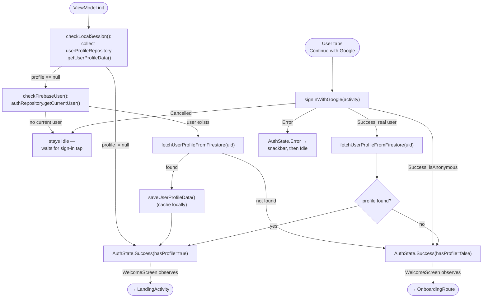

A second, unrelated background job also kicks off on init: `syncFoodsIfNeeded()` refreshes the local food cache from Firestore if it's been more than 24h since the last sync. It's fire-and-forget and has no UI.

---

## 5. Onboarding (`OnboardingViewModel`, 3 steps)

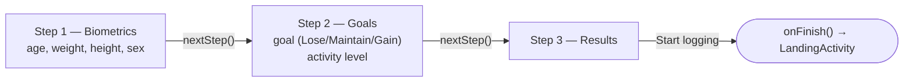

`nextStep()` autosaves partial profile data on every step transition, but the **AI target calculation only fires once, on the Results screen itself**:

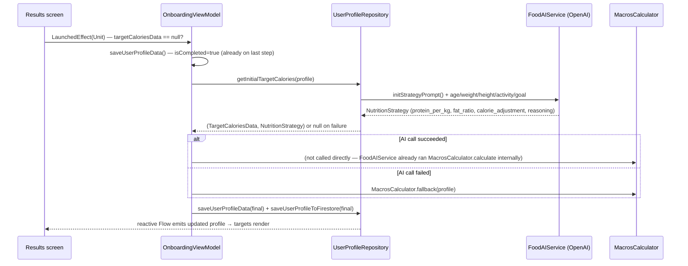

**Why the calculation is anchored to the Results screen, not the Goals screen's "Continue" button**: `viewModelScope.launch` runs on `Dispatchers.Main.immediate`, so `saveUserProfileData()`'s synchronous read of `_uiState.value.currentStep` happens *before* `nextStep()`'s later line advances the step. Calling the recalculation mid-transition would read the *old* step and never satisfy `isCompleted`. Anchoring it to `LaunchedEffect` on the screen that's already resting on the final step sidesteps the race entirely.

**What actually drives the numbers** (`MacrosCalculator.calculate`):
- **BMR** — Mifflin-St Jeor formula, branches on `sex`
- **TDEE** — BMR × activity multiplier (`SEDENTARY` 1.2 → `VERY ACTIVE` 1.9)
- **Target calories** — TDEE × `(1 + calorieAdjustment)`, where `calorieAdjustment`/`proteinPerKg`/`fatRatio` come from the AI's `NutritionStrategy` (clamped to sane ranges — the calculator never trusts raw AI output)
- **Protein** — `weight × proteinPerKg`; **Fat** — `% of target calories`; **Carbs** — remainder

Onboarding intentionally does **not** collect diet type, allergies, cuisine preference, or workout commitment days/equipment — confirmed unused by this calculation, cut in the redesign (`docs/redesign/PHASES.md`, Phase 4).

---

## 6. Meal logging — the core loop (`AIChatViewModel` + `LogFoodComponent`)

This is the screen the whole redesign is built around: every AI estimate must show what was assumed, how confident the model is, and let the user fix it in the fewest taps.

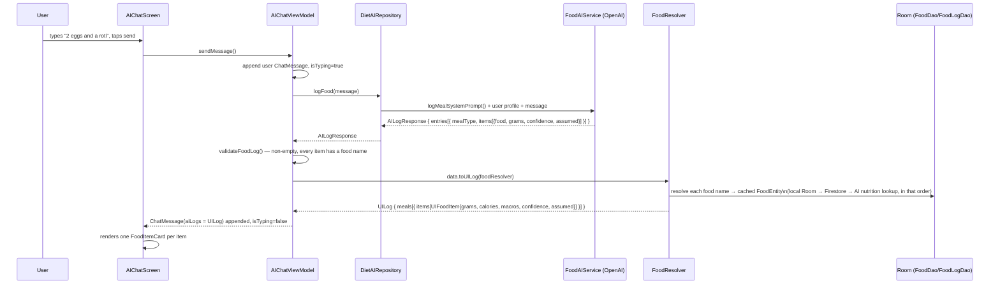

Per-item confidence comes back as a raw `0.0–1.0` score from the prompt's own bands (0.9–1.0 exact, 0.7–0.9 minor estimation, 0.4–0.7 moderate guess, <0.4 unclear) and is collapsed into the UI's 3-tier system by `ConfidenceTier.fromScore()`:

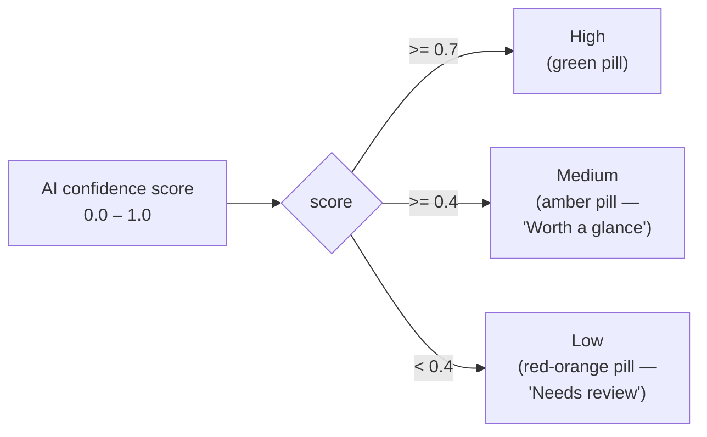

**Per-card interaction** (`FoodItemCard` in `LogFoodComponent.kt`):

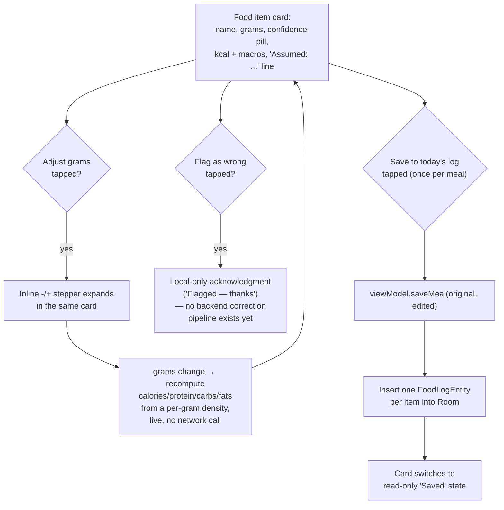

Confidence and the assumption string are **not** persisted to Room — `FoodLogEntity` only stores `foodId`/`grams`/`mealType`/`timestamp`. They exist only for the duration of the in-memory `UIFoodItem`/chat session. This is a known, documented gap (`docs/redesign/PHASES.md`, Phase 5) — meal-history rows on Fuel can't show a confidence indicator without a schema change.

---

## 7. Fuel dashboard — aggregation, history, quick-repeat (`FuelViewModel`)

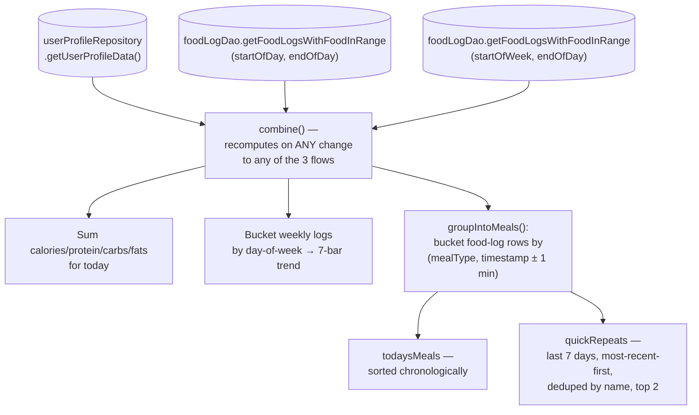

There is no "meal" table in the schema — Room only stores individual food-item rows. `groupIntoMeals()` reconstructs the meal boundary by assuming everything a single `saveMeal()` call inserted lands within the same minute (true, since it's one fast synchronous loop, not a slow multi-step process).

**Quick-repeat** deliberately bypasses the AI entirely:

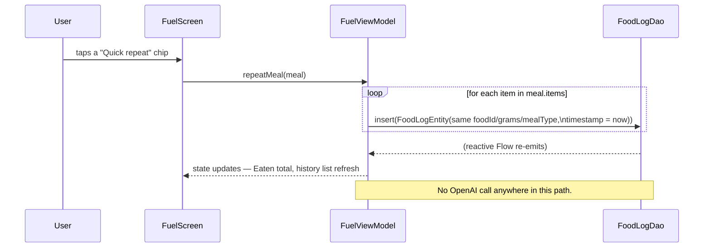

---

## 8. Profile — read + edit targets (`ProfileViewModel`)

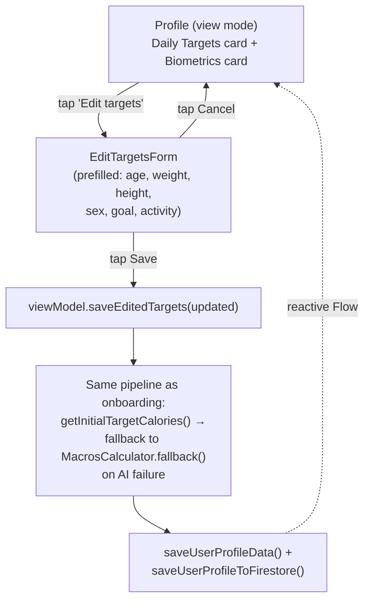

`EditTargetsForm` doesn't duplicate onboarding's input UI — it directly imports and reuses `NumberField`/`SexOption` (from `OnboardingBiometricsScreen.kt`) and `GOALS`/`ActivityOption`/`SegmentOption`/`ActivityOptionRow` (from `OnboardingGoalsScreen.kt`), which had their `private` visibility dropped specifically for this reuse.

---

## 9. AI prompts in play

| Prompt (`AIPrompts.kt`) | Called from | Returns | Consumed by |
|---|---|---|---|
| `logMealSystemPrompt()` | `FoodAIService.logFood()` | `AILogResponse` — meal(s) of food items, each with `grams`, `confidence`, `assumed` | `AIChatViewModel.sendMessage()` |
| `getNutritionPer100g(items)` | `FoodAIService.getNutritionPer100g()` | Per-100g calories/protein/carbs/fats for foods not in the local/Firestore cache | `FoodResolver` (as the last-resort tier of its 3-tier lookup) |
| `initStrategyPrompt()` | `FoodAIService.getInitialTargetCalories()` | `NutritionStrategy` — protein/kg, fat ratio, calorie adjustment, reasoning (never raw target numbers — those are computed deterministically) | `OnboardingViewModel`/`ProfileViewModel` via `MacrosCalculator.calculate()` |

`FoodResolver`'s 3-tier lookup for any food name:

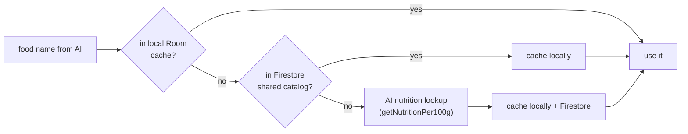

---

## 10. Data model summary

| Store | Holds | Notes |
|---|---|---|
| Room — `FoodEntity` | Cached nutrition-per-100g for known foods | Populated by `FoodResolver`'s 3-tier lookup |
| Room — `FoodLogEntity` | Individual logged food items (foodId, grams, mealType, timestamp) | No per-meal grouping column, no confidence/assumption columns — see §6/§7 gaps |
| DataStore | `UserProfileData` (biometrics, goal, activity, targets, `isCompleted`), last-food-sync timestamp | Source of truth for the profile locally; mirrored to Firestore |
| Firestore | Profile backup (`saveUserProfileToFirestore`/`fetchUserProfileFromFirestore`), shared food catalog | Backup/sync layer, not the primary read path |

---

## Where to look next

- `docs/redesign/PHASES.md` — how each screen got to its current shape, phase by phase, with what was verified live
- `docs/redesign/kinetic-redesign-v1.html` — the visual source of truth (open via a local HTTP server, not `file://`)
- `docs/APP_UPDATE.md` — what's still not production-ready (API key on-device being the big one) and the prioritized fix list
